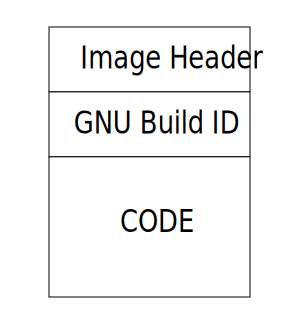

# Wavious Build Infrastructure
This project provides the common build infrastructure that is used to build
all Wavious software.

## Image Layout

### Image Header
All Wavious images are required to have a standard layout.
Most importantly every image begins with an image header. The image header
structure is detailed in `image.h`. It includes several fields that are setup
based on the current state of the software SCM so that any software image can
be traced back to some "snapshot" of the source code that produced the image.

CMake functions are provided that extract this metadata out of the build
environment and injects them into the code. It is up to each application if
it wants to use these defintions directly in the code or manage them
sperately.

The current set of build variables are as follows:

~~~
BUILD_DATE              Date that build occured
BUILD_MACHINE           Name of the machine that produced the image
VERSION_MAJOR           Major Version of Semantic Versioning*
VERSION_MINOR           Minor Version of Semantic Versioning*
VERSION_PATCH           Patch Version of Semantic Versioning*
VERSION_TWEAK           Tweak Version of Semantic Versioning*
VERSION_AHEAD           Number of commits ahead the code that produced the image
                        is from the Semantic Versioning Tag.
VERSION_GIT_SHA         The SHA of the commit that produced the image
VERSION_DIRTY           Flag to indicate if commit is dirty. Dirty means that
                        there are local changes that have not been commited.

* Assumes that a Semantic Version Tag is used in each project
~~~

#### Configuration
To include the header as part of the binary, an image header must be declared
somewhere in the code. An obvious place is at the application level such that
each application can have its own, unique header. The section attribute must
be declared so that the header is placed in the correct location in the image.
Otherwise, the linker would place the header in a indeterminent location that
would be unqiue for every build. An example is provided below.
~~~
img_hdr_t image_hdr __attribute__((section(".image_hdr"))) = {
    .image_magic = IMAGE_MAGIC,
    .image_hdr_version = IMAGE_VERSION_CURRENT,
    .image_type = IMAGE_TYPE_APP,
    .version_major = FW_VERSION_MAJOR,
    .version_minor = FW_VERSION_MINOR,
    .version_patch = FW_VERSION_PATCH,
    .vector_addr = (uint32_t) &__start,
    .device_id = IMAGE_DEVICE_ID_HOST,
    .git_dirty = GIT_DIRTY,
    .git_ahead = GIT_AHEAD,
    .git_sha = GIT_SHA,
    // populated as part of a post compilation step
    .crc = 0,
    .data_size = 0,
};
~~~

To include the image header as part of the binary add the following lines
to the linker script:
~~~
KEEP (*(.image_hdr))
~~~
This should be placed at the beginning of the program memory.

### GNU Build ID
The GNU build ID is a 160-bit SHA1 string computed over the elf header bits and
section contents in the file. It provides another auditing mechanism that can
unqiuely identify an image. It is possilbe for two separate versions of the
source code to produce the same build variables described above. However, those
two versions could not produce the same GNU build ID unless they had the same
changes.

The GNU Build ID is optional, but is highly encouraged. To generate the build
ID, two configurations must be done by the linker.

#### Configuration
The linker must be given the following option to produce a GNU build ID in the
ELF file:
~~~
-Wl,--build-id
~~~

To include the GNU build ID in the actual binary, update the linker script
to include the following lines:
~~~
PROVIDE(g_note_build_id = .);
KEEP(*(.note.gnu.build-id))
~~~

Typically, this will be added immediately after the .image_hdr part of the
linker script. Additionally, the firmware can decode the
build ID using the g_note_build_id variable. See this
[link](https://interrupt.memfault.com/blog/gnu-build-id-for-firmware#reading-the-build-id-in-firmware)
for more details.

## Project Organization
At a high-level the project is organized into the following categories:

### CMake
CMake directory includes all of the CMake related files needed for building
Wavious software images. In general, it handles parsing metadata out of Git
(semantic version, Git SHA, etc) and setting up build variables that can be
used in the image header.

### Include
This includes the image header structure that should be used for all binaries
that include the header.

### Scripts
This includes supporting scripts for patching image header, and parsing out
raw header information (image header, GNU build ID) from compatible binaries.
